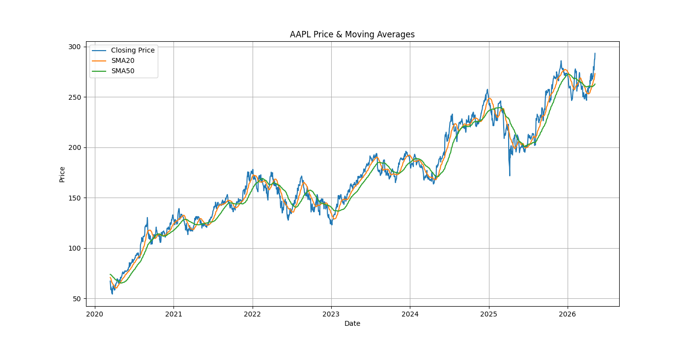
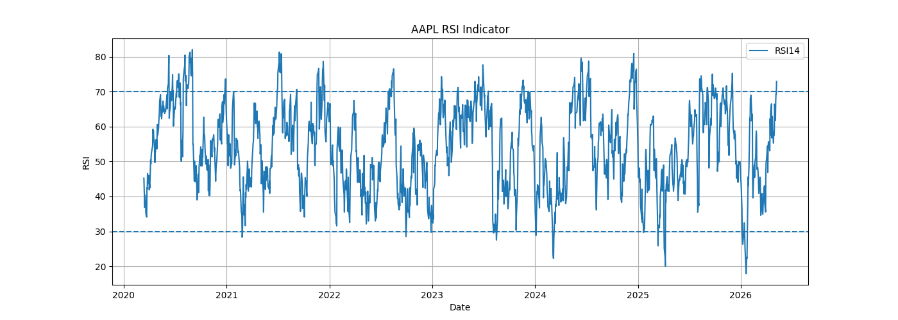
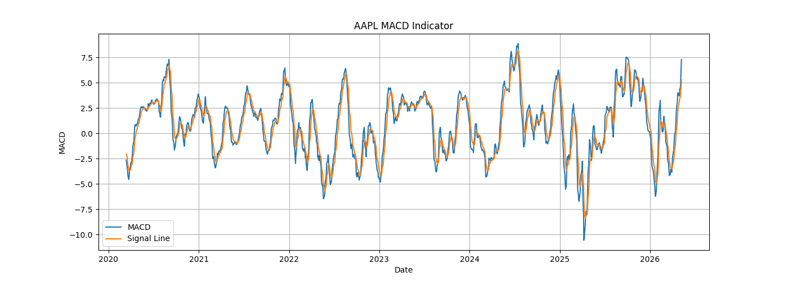
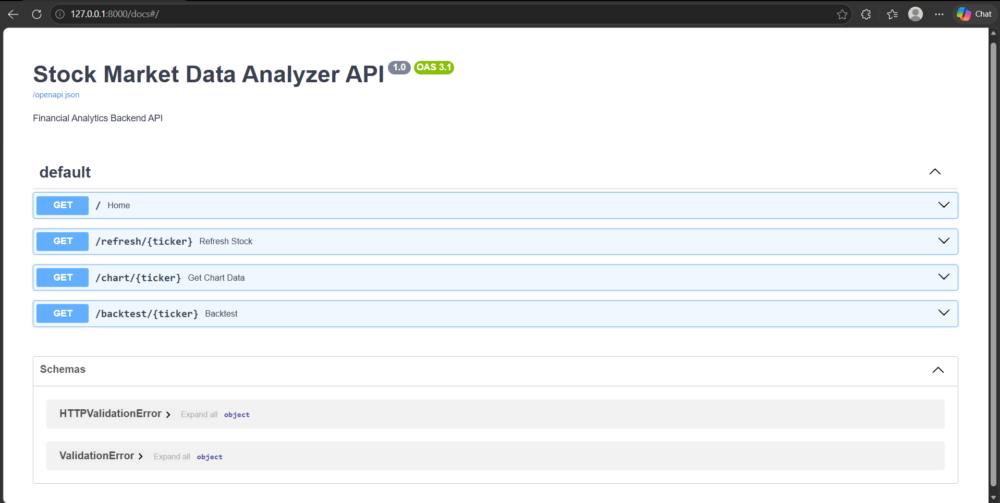
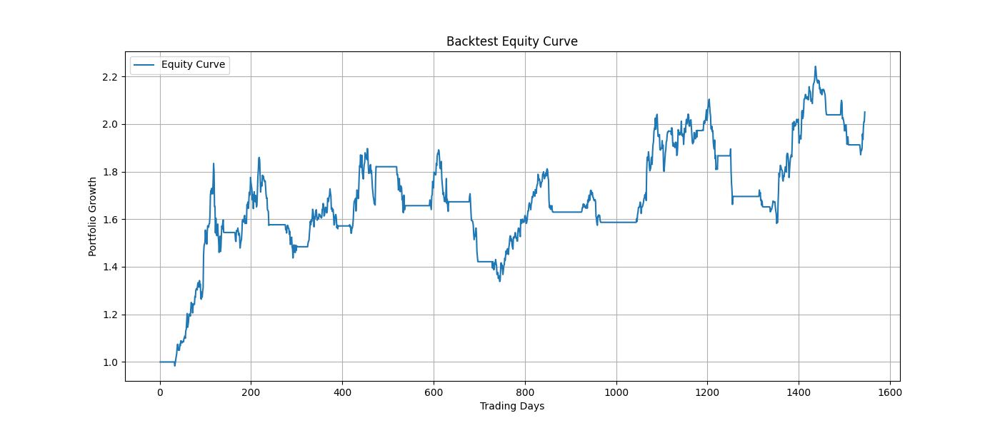

# 📈 Stock Market Data Analyzer

A professional full-stack financial analytics dashboard built using Python, Streamlit, SQLite, Plotly, and FastAPI. This project fetches real-time historical stock market data, calculates technical indicators, performs strategy backtesting, and visualizes insights through an interactive dashboard.

---

## 🚀 Features

✅ Real-time Stock Data Fetching using Yahoo Finance  
✅ Interactive Streamlit Dashboard  
✅ Technical Indicators Calculation  
✅ SMA20 & SMA50 Moving Averages  
✅ RSI (Relative Strength Index)  
✅ MACD Indicator  
✅ Backtesting Engine  
✅ Equity Curve Generation  
✅ SQLite Database Integration  
✅ FastAPI Backend Support  
✅ Professional Dark-Themed UI  
✅ Multi-Stock Support  
✅ CSV Export Support  
✅ Financial Data Visualization with Plotly  

---

## 🛠️ Tech Stack

- Python
- Streamlit
- SQLite
- Plotly
- Pandas
- NumPy
- yFinance
- FastAPI
- SQLAlchemy

---

# 📂 Project Structure

```bash
Stock-Market-Data-Analyzer/
│
├── api/
│   └── app.py
│
├── data/
│
├── db/
│   ├── market.db
│   └── schema.sql
│
├── images/
│   ├── AAPL_macd_chart.png
│   ├── AAPL_price_sma_chart.png
│   ├── AAPL_rsi_chart.png
│   ├── api.png
│   └── equity_curve_chart.png
│
├── outputs/
│   ├── backtest_equity_curve.csv
│   ├── backtest_results.csv
│   └── Stock_market_demo.mp4
│
├── src/
│   ├── ingest.py
│   ├── indicators.py
│   ├── backtest.py
│   ├── database.py
│   └── schema.sql
│
├── dashboard.py
├── requirements.txt
├── README.md
├── test_db.py
├── check_data.py
└── check_indicators.py
```

---

# ⚙️ Installation & Setup

## 1️⃣ Clone the Repository

```bash
git clone https://github.com/Swetha07062003/Stock-Market-Data-Analyzer.git
```

## 2️⃣ Navigate into the Project

```bash
cd Stock-Market-Data-Analyzer
```

## 3️⃣ Create Virtual Environment

### Windows

```bash
python -m venv venv
```

## 4️⃣ Activate Virtual Environment

### Windows PowerShell

```bash
venv\Scripts\activate
```

## 5️⃣ Install Dependencies

```bash
pip install -r requirements.txt
```

---

# 🗄️ Database Setup

## Create SQLite Database Tables

```bash
python src/database.py
```

---

# 📥 Fetch Stock Market Data

```bash
python src/ingest.py
```

This downloads historical stock market data and stores it inside SQLite database.

---

# 📊 Generate Technical Indicators

```bash
python src/indicators.py
```

This calculates:

- SMA20
- SMA50
- RSI14
- MACD
- Bollinger Bands

---

# 📈 Run Backtesting Engine

```bash
python src/backtest.py
```

This generates:

- Strategy Returns
- Equity Curve
- Sharpe Ratio
- Win Rate
- Maximum Drawdown

---

# 🖥️ Launch Streamlit Dashboard

```bash
streamlit run dashboard.py
```

Open browser:

```bash
http://localhost:8501
```

---

# ⚡ Run FastAPI Backend

```bash
uvicorn api.main:app --reload
```

API Documentation:

```bash
http://127.0.0.1:8000/docs
```

---

# 📊 Dashboard Preview

## Price and moving charges



---

## 📈 RSI Indicator Analysis



---

## 📉 MACD Technical Indicator



---

## ⚡ FastAPI Backend



---

## 💹 Equity Curve Analysis



---

# 📉 Backtesting Results

| Metric | Result |
|---|---|
| Profit/Loss | 105.02% |
| Sharpe Ratio | 0.68 |
| Max Drawdown | -29.45% |
| Total Trades | 37 |
| Win Rate | 31.31% |

---

# 🎥 Demo Video

## Full Project Demo

[▶️ Watch Demo Video](outputs/Stock_market_demo.mp4)

---

# 📚 Key Learnings

- Financial Data Analysis
- Technical Indicator Engineering
- Algorithmic Trading Concepts
- Database Integration
- Backend API Development
- Interactive Dashboard Design
- Data Visualization
- Backtesting Strategies

---

# 🔮 Future Improvements

- Real-time Live Market Data
- AI-based Stock Prediction
- Portfolio Optimization
- News Sentiment Analysis
- Deployment on Cloud
- User Authentication
- Advanced Trading Strategies

---

# 👩‍💻 Author

## Swetha K


---

